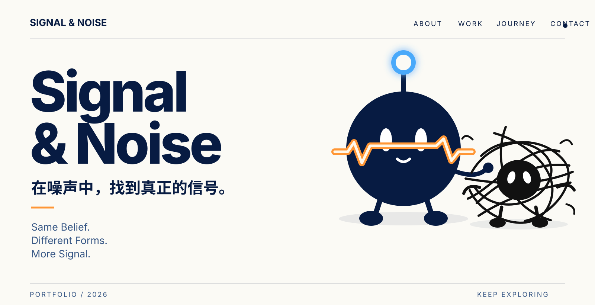
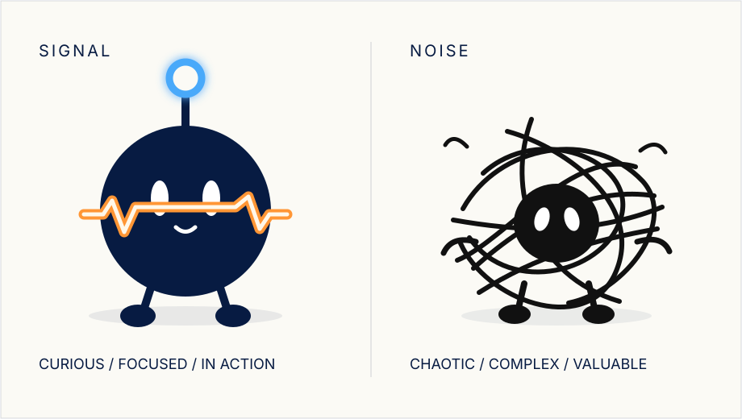
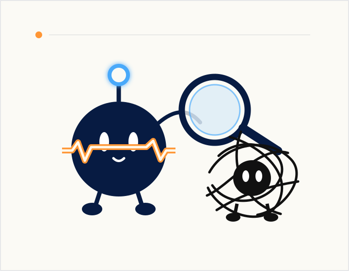
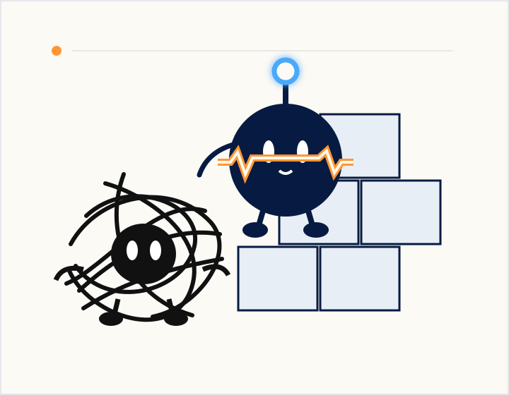
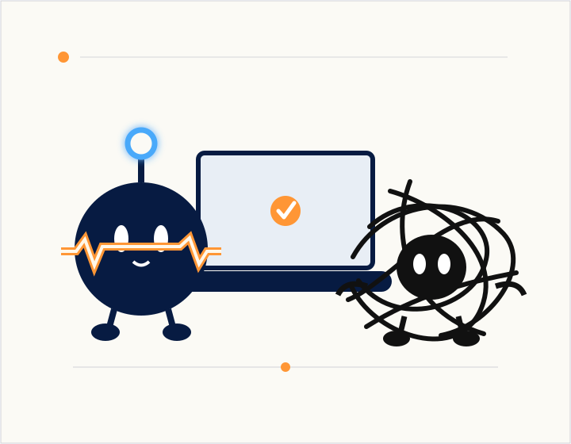
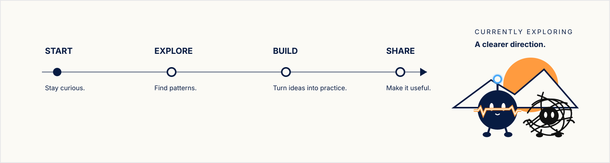
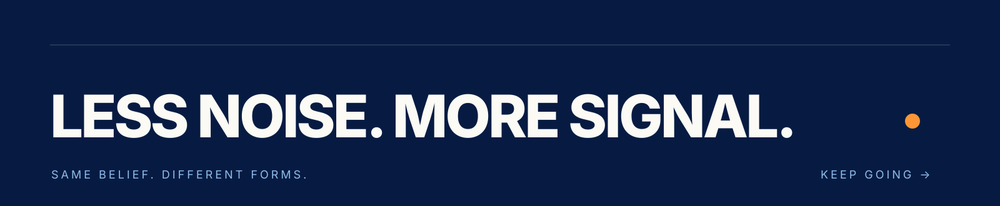

<!--
  SIGNAL & NOISE / GITHUB PROFILE
  Edit the copy marked with "EDIT" comments when your personal content is ready.
-->

  

  

<!-- EDIT: 把下面两段替换成你的个人介绍。 -->

<table>
  <tr>
    <td width="42%" valign="top">
      01 — ABOUT
      <h2>在噪声中， 找到真正的信号。</h2>
      

        这是一个关于辨识、整理与创造的个人空间。
        我关注如何从复杂问题中找到清晰方向，再把方向变成真正可用的东西。
      

      
<strong>Same belief. Different forms. More signal.</strong>

    </td>
    <td width="58%" align="center" valign="middle">
      
    </td>
  </tr>
</table>

 

02 — SELECTED WORK

## SELECTED WORK

<!-- EDIT: 修改项目名称、介绍和链接；每个项目建议只保留一句价值描述。 -->

<table>
  <tr>
    <td width="33.33%" valign="top">
      
        
      01 / FIND THE SIGNAL 
      <strong>一键生成icon包</strong>
      
自动生成图标-切图-命名

      研究 · 筛选 · 结构化
    </td>
    <td width="33.33%" valign="top">
      
        
      02 / ORGANIZE THE NOISE 
      <strong>为复杂问题建立秩序</strong>
      
拆解模糊需求，整理约束，让想法逐渐拥有可以交付的形状。

      系统 · 工作流 · 产品
    </td>
    <td width="33.33%" valign="top">
      
        
      03 / BUILD WITH CLARITY 
      <strong>把理解变成真实进展</strong>
      
用小步实验连接设计与工程，从洞察走到真正可用的结果。

      设计 · 工程 · 迭代
    </td>
  </tr>
</table>

 

03 — JOURNEY

## JOURNEY

  

<!-- EDIT: 用你真实的年份、经历和成果替换下面内容。 -->

  
<strong>展开经历与足迹</strong>

   

  | 时间 | 阶段 | 留下的东西 |
  |---|---|---|
  | 现在 | 正在探索 | 写下你目前最重要的方向 |
  | 上一阶段 | 一次关键转折 | 写下它如何改变了你 |
  | 更早 | 起点 | 写下你为什么开始创造 |

 

04 — CURRENTLY EXPLORING

## CURRENTLY EXPLORING

<!-- EDIT: 保留 3–4 个你真正投入的主题。 -->

`NEW IDEAS` &nbsp;&nbsp; `BETTER WORKFLOWS` &nbsp;&nbsp; `MEANINGFUL PROJECTS` &nbsp;&nbsp; `A CALMER MIND`

我正在练习分辨什么值得关注、怎样整理复杂度，以及如何把好想法变成持续发生的行动。

 

05 — CONTACT

## CONTACT

想交流项目、方法或新的可能，欢迎在 GitHub 找到我。

  <a href="https://github.com/m2290526022-boop"><strong>GitHub ↗</strong></a>
  <!-- EDIT: 有个人网站或邮箱后，可在这里继续添加链接。 -->

 

  

