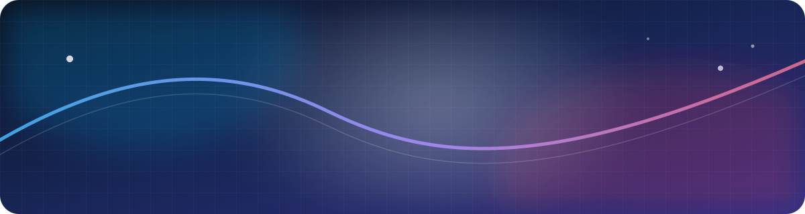

<!--
  GitHub Profile README 模板
  1. 全局搜索 {{，逐项替换占位符
  2. 删除不需要的章节或链接
  3. 将本文件和 assets/ 放进“与 GitHub 用户名同名”的公开仓库根目录
-->

  

<h1 align="center">你好，我是 {{你的名字}} 👋</h1>

  {{你的身份或职业}} · {{你关注的方向}} · {{一句有记忆点的自我定位}}

  <a href="{{个人网站链接}}">个人网站</a> ·
  <a href="mailto:{{你的邮箱}}">Email</a> ·
  <a href="{{社交主页链接}}">{{社交平台名称}}</a> ·
  <a href="{{简历链接}}">个人简历</a>

---

## 关于我

我是 **{{你的名字}}**，目前是一名 {{职业/身份}}。我喜欢 {{兴趣或擅长解决的问题}}，尤其关注 {{领域 1}}、{{领域 2}} 和 {{领域 3}}。

- 🔭 目前正在：{{正在推进的事情}}
- 🌱 最近学习：{{正在学习的主题}}
- 🧭 长期关注：{{你希望长期探索的问题}}
- 🤝 欢迎交流：{{你愿意接受的合作或话题}}
- 📍 所在地：{{城市 / 时区}}

> {{一句能代表你的话、工作原则或价值观。}}

## 现在

<!-- 这一节保持短小，每隔一两个月更新一次。 -->

我现在主要投入在 **{{当前重点项目或目标}}**，希望通过它解决 {{目标用户}} 的 {{核心问题}}。当前进展：{{一句话进展}}。

## 经历与足迹

<!-- 不必写成完整简历，只保留塑造了今天的你的关键节点。 -->

| 时间 | 经历 | 成果与收获 |
|---|---|---|
| {{2025—现在}} | **{{公司 / 项目 / 阶段}}** · {{角色}} | {{做成了什么，最好包含结果或数字}} |
| {{2023—2025}} | **{{公司 / 项目 / 阶段}}** · {{角色}} | {{承担的工作与重要收获}} |
| {{更早}} | **{{学校 / 转折点 / 独立经历}}** | {{它如何影响了你的方向}} |

## 精选项目

<!-- 建议只放 3–5 个最能代表你的项目；项目名称应链接到仓库或演示页。 -->

| 项目 | 解决的问题 | 我的工作与成果 | 技术 |
|---|---|---|---|
| [**{{项目 A}}**]({{项目 A 链接}}) | {{一句话说明用户和问题}} | {{你的职责；量化成果}} | `{{技术 1}}` `{{技术 2}}` |
| [**{{项目 B}}**]({{项目 B 链接}}) | {{一句话说明用户和问题}} | {{你的职责；量化成果}} | `{{技术 1}}` `{{技术 2}}` |
| [**{{项目 C}}**]({{项目 C 链接}}) | {{一句话说明用户和问题}} | {{你的职责；量化成果}} | `{{技术 1}}` `{{技术 2}}` |

## 项目旅程

<!-- 这里适合放“走过的项目”，包括已结束但对你很重要的尝试。 -->

<strong>{{年份或阶段一}}：{{这一阶段的主题}}</strong>

 

- [{{项目名称}}]({{项目链接}})：{{做了什么、为什么做、最后学到了什么}}
- [{{项目名称}}]({{项目链接}})：{{做了什么、为什么做、最后学到了什么}}

<strong>{{年份或阶段二}}：{{这一阶段的主题}}</strong>

 

- [{{项目名称}}]({{项目链接}})：{{做了什么、为什么做、最后学到了什么}}
- [{{项目名称}}]({{项目链接}})：{{做了什么、为什么做、最后学到了什么}}

## 技能与工具

<!-- 保留真正熟悉、愿意被追问的内容。 -->

- **主要方向：** {{产品工程 / 后端 / 前端 / AI / 数据 / 设计等}}
- **常用语言：** `{{语言 1}}` `{{语言 2}}` `{{语言 3}}`
- **框架与工具：** `{{工具 1}}` `{{工具 2}}` `{{工具 3}}`
- **我尤其擅长：** {{把能力写成结果，例如“把模糊需求变成可验证的产品原型”}}

## 写作与分享

<!-- 没有写作内容时可以整节删除。 -->

- [{{文章 / 演讲标题}}]({{链接}}) — {{一句话摘要}}
- [{{文章 / 演讲标题}}]({{链接}}) — {{一句话摘要}}
- [查看更多内容]({{博客或内容主页}})

## 联系我

如果你想聊聊 **{{话题 1}}**、**{{话题 2}}**，或者有合适的合作机会，欢迎通过 [Email](mailto:{{你的邮箱}}) 联系我。

  感谢你来到这里。愿我们都能持续创造值得留下的东西。

