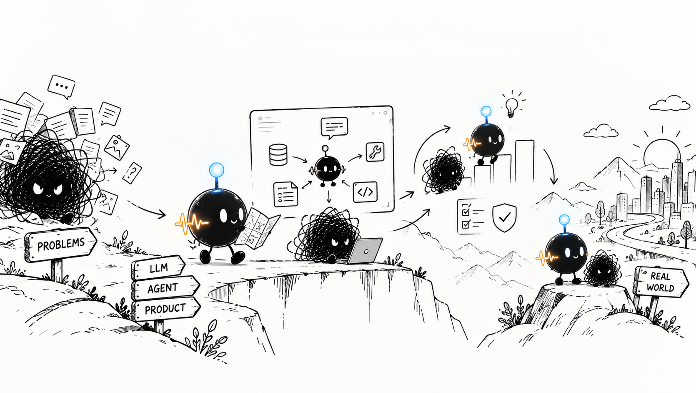
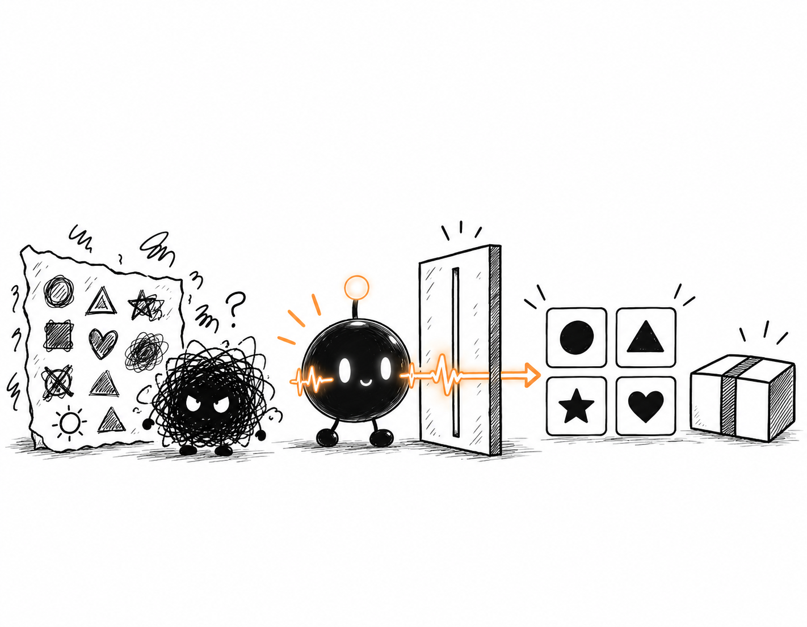
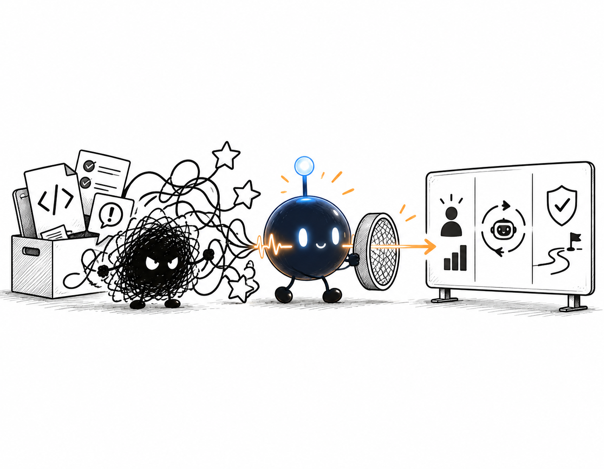
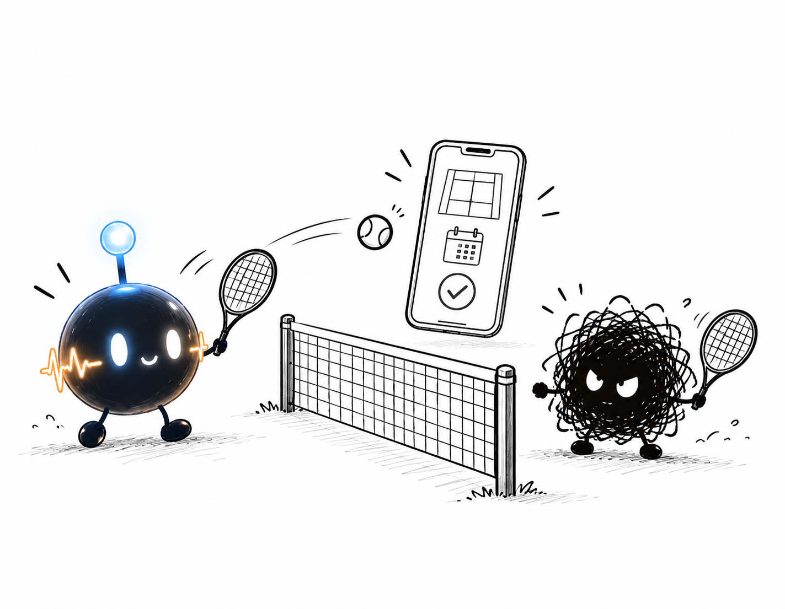

<!--
  SIGNAL & NOISE / GITHUB PROFILE
  Edit the copy marked with "EDIT" comments when your personal content is ready.
-->

  

<!-- EDIT: 把下面两段替换成你的个人介绍。 -->

<table>
  <tr>
    <td width="42%" valign="top">
      01 — ABOUT ME
      <h2>Signal  噪声中找到真正的信号。</h2>
      

        Interested in AI‑Agent system design & LLM product management.
        Continuously explore Agent capability iteration, reliability and real‑world business landing.
        深耕 AI Agent 领域，聚焦大模型 Agent 产品设计，研究 Agent 能力迭代、可靠性与业务落地。
      

    </td>
    <td width="58%" align="center" valign="middle">
      
    </td>
  </tr>
</table>

 

02 — RECENT WORKS

## RECENT WORKS

<!-- EDIT: 修改项目名称、介绍和链接；每个项目建议只保留一句价值描述。 -->

<table>
  <tr>
    <td width="33.33%" valign="top">
      
        
      01 / FIND THE SIGNAL 
      <strong>一键生成icon包</strong>
      
自动生成图标-切图-命名

      研究 · 筛选 · 结构化
    </td>
    <td width="33.33%" valign="top">
      
        
      02 / ORGANIZE THE NOISE 
      <strong>为产品经理项目分析所建</strong>
      
拆解模糊需求，整理约束，让想法逐渐拥有可以交付的形状。

      系统 · 工作流 · 产品
    </td>
    <td width="33.33%" valign="top">
      
        
      03 / BUILD WITH CLARITY 
      <strong>网搭星球小程序</strong>
      
用小步实验连接设计与工程，从洞察走到真正可用的结果。

      设计 · 工程 · 迭代
    </td>
  </tr>
</table>

 

